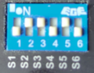

Firmware for controlling the [OSSM (Open Source Sex Machine)](https://github.com/KinkyMakers/OSSM-hardware) via the [XToys.app](https://xtoys.app) website.

The firmware enables the OSSM to be controlled via serial, Bluetooth or websocket commands.

Uses a [slightly modified version](https://github.com/denialtek/StrokeEngine) of the [StrokeEngine](https://github.com/theelims/StrokeEngine) library to interact with the OSSM.

# Automatic Setup

The firmware can be installed directly from the XToys website via these steps:
1. Connect your OSSM via USB cable.
2. Load the OSSM block in XToys and click the grey connect button.
3. Select the download icon beside the v2.0 label and follow the install steps.

# Manual Setup

1. On your OSSM motor set the DIP switches to:  
  
**Note:** If the dildo is mounted on the left side of the OSSM (the side with the USB port) then flip S6 to ON instead
2. Connect your OSSM via USB cable.
3. Download and extract the repository.
4. Install [Visual Studio Code](https://code.visualstudio.com) and the [PlatformIO](https://platformio.org/platformio-ide) extension.
5. In Visual Studio go to File > Open and select the XToys-OSSM firmware folder.
6. Open the config.h file (OSSM > src > config.h).

If you want to use Bluetooth fill out these fields:  
#define COMPILE_BLUETOOTH true  
#define COMPILE_WEBSOCKET false  
#define BLE_NAME "OSSM"

If you want to use Websockets fill out these fields:  
#define COMPILE_BLUETOOTH false  
#define COMPILE_WEBSOCKET true  
#define WIFI_SSID "your network ssid"  
#define WIFI_PSK "your network password"

If you use non-standard pins on the ESP32 this can also be adjusted here.

6. Click the PlatformIO icon in the left side bar and then click the Upload button (Project Tasks > esp32dev > Upload).

**NOTE: The firmware will not work if both COMPILE_BLUETOOTH and COMPILE_WEBSOCKET are set to true. Only use one or the other.**

# Command Structure

XToys sends JSON messages over Bluetooth, serial or websocket depending on what connection method the user chose in XToys.

The JSON is always an array of objects where each object contains an "action" key as well as additional values as needed.

ex.  

    [
        { "action": "startStreaming" },
        { "action": "move", "position": 100, "time": 200 },
        { "action": "move", "position": 0, "time": 0 }
    ]

# Supported Commands

| XToys Event                                               | Action Name        | Sample JSON                                                                                                                                                                                    |
|-----------------------------------------------------------|--------------------|------------------------------------------------------------------------------------------------------------------------------------------------------------------------------------------------|
| On Connect                                                | connected          | { "action": "connected" }                                                                                                                                                                |
| On homing selected                                        | home               | { "action": "home", "type": "auto" // or "manual" }                                                                                                                                   |
| On Speed mode selected                                    | setPattern         | { "action": "setPattern", "pattern": 0 // XToys only ever sends pattern 0 }                                                                                                           |
| On speed set to 0                                         | stop               | { "action": "stop" }                                                                                                                                                                     |
| On speed set to >0                                        | setSpeed           | { "action": "setSpeed", "speed": 50 // 0-100 }                                                                                                                                        |
| On upper stroke length changed                            | setDepth           | { "action": "setDepth", "depth": 50 // 0-100 }                                                                                                                                        |
| On lower stroke length changed                            | setStroke          | { "action": "setStroke", "stroke": 50 // 0-100 }                                                                                                                                      |
| On Position mode selected                                 | startStreaming     | { "action": "startStreaming" }                                                                                                                                                           |
| On position changed (manually or via pattern)             | move               | { "action": "move", "position: 50, // 0-100 "time": 500, // ms "replace": true // whether to wipe the existing pending position commands (ex. when user has changed patterns) } |
| On manual disconnect or homing cancelled                  | disable            | { "action": "disable" }                                                                                                                                                                  |
| On firmware flash complete and Bluetooth being configured | configureBluetooth | { 	"action": "configureBluetooth", 	"name": "OSSM" // desired Bluetooth name }                                                                                                          |
| On firmware flash complete and Websocket being configured | configureWebsocket | { 	"action": "configureWebsocket", 	"ssid": "MyNetwork", 	"password": "mysecretpassword" }                                                                                            |
| On connect and version being checked                      | version            | { 	"action": "version" }                                                                                                                                                                  |

Actions that are in the OSSM firmware code but are not sent via XToys currently:
- "getPatternList"
- "setup"
- "retract"
- "extend"
- "setSensation"
